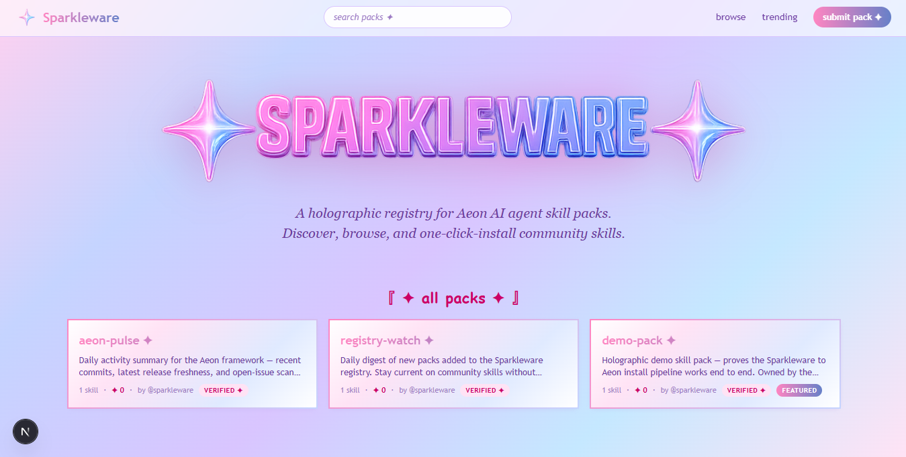

<p align="center">
  
</p>

<h1 align="center">SPARKLEWARE ✦</h1>

<p align="center">
  <a href="./LICENSE"></a>
  <a href="https://github.com/sparkleware/sparkleware/stargazers"></a>
  <a href="https://github.com/sparkleware/sparkleware/network/members"></a>
  <a href="https://github.com/aaronjmars/aeon"></a>
</p>

<p align="center">
  <strong>A holographic registry for Aeon AI agent skill packs.</strong><br>
  Discover, browse, and one-click-install skills built by the community. Y2K aesthetic — because tool directories shouldn't all look like enterprise SaaS.
</p>

<p align="center">
  <em>🚧 Pre-launch — registry + website both live; community pack onboarding in progress.</em>
</p>

<p align="center">
  
</p>

---

## What this is

The [Aeon](https://github.com/aaronjmars/aeon) AI agent framework ships with 121 built-in skills and accepts community packs via `./install-skill-pack <repo>`. The problem: there's no central place to *discover* those packs. Skills are scattered across GitHub topic search, README mentions, and one-off Twitter threads.

Sparkleware fixes that — a public catalog with search, categories, install commands, and quality signals (verified badge, freshness, stars).

---

## Why Sparkleware?

|  | Sparkleware | GitHub topic search | Awesome-lists | Plain README |
|--|---|---|---|---|
| Search by category | Yes | Keywords only | No | No |
| One-click install command | Yes | No | Usually | No |
| Quality signals (verified, freshness, stars) | Yes | Stars only | No | No |
| Submission flow for maintainers | PR or auto-discovery | N/A | PR | N/A |
| Native to Aeon's `./install-skill-pack` | Yes | Yes | Sometimes | Yes |
| Daily-refreshed | Yes (GitHub Action) | Yes | Usually stale | Static |
| Visual / aesthetic | Y2K holographic | Minimalist | Plain text | Plain text |

The key difference: **other discovery surfaces are passive (lists, search). Sparkleware is curated, validated, and built for one-click adoption.**

---

## Two ways to get a pack listed

**Path A — Auto-discovery (easiest):**
1. Add the GitHub topic `aeon-skill-pack` to your repo.
2. A daily crawler picks it up within 24 hours.
3. Pack appears with the `auto-indexed` badge.

**Path B — Verified submission (recommended for serious packs):**
1. Open a PR adding `registry/packs/<your-handle>/<pack-name>.json`.
2. CI validates the schema; a maintainer reviews within ~3 business days.
3. On merge, your pack gets the `verified ✦` badge — higher placement, eligible for `featured` curation.

Full submission guide and JSON template: [`registry/CONTRIBUTING.md`](./registry/CONTRIBUTING.md).

---

## Quick start

### Browse packs

Coming soon at `https://sparkleware.fun`. Current catalog data is at [`registry/packs/`](./registry/packs/).

### Run the registry locally

**Prerequisites:** Node.js 20+, pnpm 8+ (or use `corepack`).

```bash
git clone https://github.com/sparkleware/sparkleware
cd sparkleware/registry
pnpm install
pnpm test       # 5 unit tests over the schema
pnpm validate   # validate every manifest in packs/
```

CI runs the same commands on every PR touching `registry/**`.

### Run the website locally

Pending — the Next.js scaffold lands in upcoming commits. Tech stack is locked in [`docs/spec.md`](./docs/spec.md) §8 (Next.js 15 App Router, static export, Cloudflare Pages).

---

## Project structure

```
sparkleware/
├── README.md              ← you are here
├── CONTRIBUTING.md        ← contributor guide (top-level)
├── SECURITY.md            ← security disclosure policy
├── LICENSE                ← MIT
│
├── registry/              ← ✅ pack data subsystem (shipped)
│   ├── pack-schema.json   ← JSON Schema 2020-12 contract
│   ├── packs/             ← <author>/<name>.json — one file per pack
│   ├── scripts/
│   │   ├── validate.ts        ← CLI validator (also runs in CI)
│   │   └── validate.test.ts   ← 5 Vitest cases
│   ├── tests/fixtures/    ← schema test fixtures (valid + invalid samples)
│   ├── CONTRIBUTING.md    ← how to submit a pack
│   └── README.md          ← registry-only quickstart
│
├── src/                   ← 🚧 website source (Next.js App Router) — WIP
│   ├── app/               ← pages: home, browse, pack/[author]/[name], etc.
│   ├── components/        ← HoloCard, InstallCommand, SearchBar, ...
│   ├── lib/               ← registry loader, GitHub enrichment, trending algo
│   └── styles/            ← Y2K holographic design tokens (CSS variables)
│
├── docs/
│   └── spec.md            ← full design specification (palette, IA, data model)
│
├── assets/                ← brand assets (logo, hero image, OG card)
│
└── .github/
    ├── ISSUE_TEMPLATE/    ← bug report, broken pack, feature request
    ├── PULL_REQUEST_TEMPLATE/
    │   └── pack-submission.md
    └── workflows/
        └── validate-registry.yml  ← runs validator on registry/** changes
```

---

## Aesthetic direction

Sparkleware leans into a maximalist Y2K aesthetic — holographic gradients, pearl pastels, Comic Sans accents, Pokémon TCG foil energy. This is intentional differentiation: the AI dev-tools space is saturated with minimalist Vercel-clone designs.

Mood references: Remilia Corporation, Milady NFT, Pokémon TCG holographic foil cards, late-1990s sticker sheets.

Full design language: [`docs/spec.md`](./docs/spec.md) §4.

---

## Contributing

Two distinct contribution flows. Detailed guide: [`CONTRIBUTING.md`](./CONTRIBUTING.md).

- **Submitting a pack** → [`registry/CONTRIBUTING.md`](./registry/CONTRIBUTING.md)
- **Website code / docs / general** → [`CONTRIBUTING.md`](./CONTRIBUTING.md)
- **Reporting a broken pack** → [open an issue](../../issues/new/choose) with the "Broken pack" template
- **Security issues** → [`SECURITY.md`](./SECURITY.md) — please don't open public issues for vulnerabilities

---

## FAQ

### What is a "skill pack"?

A bundle of one or more skills (instructions + scripts) that extend the [Aeon AI agent framework](https://github.com/aaronjmars/aeon). Each skill is a focused capability — like "monitor a DeFi position" or "summarize HackerNews trending". A pack groups related skills under one author / installable unit.

### How is Sparkleware different from just searching GitHub?

GitHub search returns repos. Sparkleware adds: category filtering, verified-vs-auto-indexed quality tiers, one-click install commands, freshness signals, and a curated featured section. It's a discovery surface designed for *"I want a pack for X"*, not *"show me everything tagged Y"*.

### Who maintains the registry?

Currently a single maintainer (a community project). As the registry grows, governance will open up — see [`CONTRIBUTING.md`](./CONTRIBUTING.md).

### Do you host the pack source code?

No. The registry stores **metadata only** (one JSON file per pack); the actual pack code lives in the maintainer's own GitHub repo. Sparkleware links to it; Aeon's `./install-skill-pack <repo>` clones it.

### What gets indexed automatically?

Any public GitHub repo with the topic `aeon-skill-pack`. A daily crawler picks it up and lists it with the `auto-indexed` badge (lower trust signal). For higher trust + manual curation, open a verified submission PR — see [`registry/CONTRIBUTING.md`](./registry/CONTRIBUTING.md).

### How do you handle abandoned packs?

Packs whose source repo becomes unreachable for 30+ days are auto-archived (hidden from browse, detail page stays up with a notice). Anyone can report a broken pack via the issue tracker.

### What's the tech stack?

- **Registry:** TypeScript + pnpm + Vitest + ajv (JSON Schema draft 2020-12 validator). Data + scripts, no website code.
- **Website (in progress):** Next.js 15 App Router with `output: 'export'`, deployed to Cloudflare Pages. Pagefind for client-side static search. No backend in v1.

Full stack rationale: [`docs/spec.md`](./docs/spec.md) §8.

### Why Y2K aesthetic?

Differentiation. The AI dev-tools space is saturated with near-identical minimalist designs. A maximalist holographic catalog is memorable, shareable, and signals "this isn't enterprise-coded — this is for people who care about taste."

### Is there a public roadmap?

Current scope and deferred items: [`docs/spec.md`](./docs/spec.md) §10 (v1 MVP scope) and §13 (future considerations — ratings, OAuth, author dashboards, etc.).

### How can I help?

Submit a pack (Path A or B above), file issues for broken packs, contribute website code once the scaffold ships, or just star the repo to signal interest.

---

## Acknowledgments

Built around the [Aeon](https://github.com/aaronjmars/aeon) AI agent framework by [@aaronjmars](https://github.com/aaronjmars). Aeon's `./install-skill-pack` is the canonical installer that Sparkleware indexes packs for — without it, none of this works.

Aesthetic inspiration: Remilia Corporation, Milady NFT, Pokémon TCG holographic foil cards, late-1990s sticker sheets.

---

## Star History

[](https://www.star-history.com/#sparkleware/sparkleware&Date)

---

## License

[MIT](./LICENSE).
